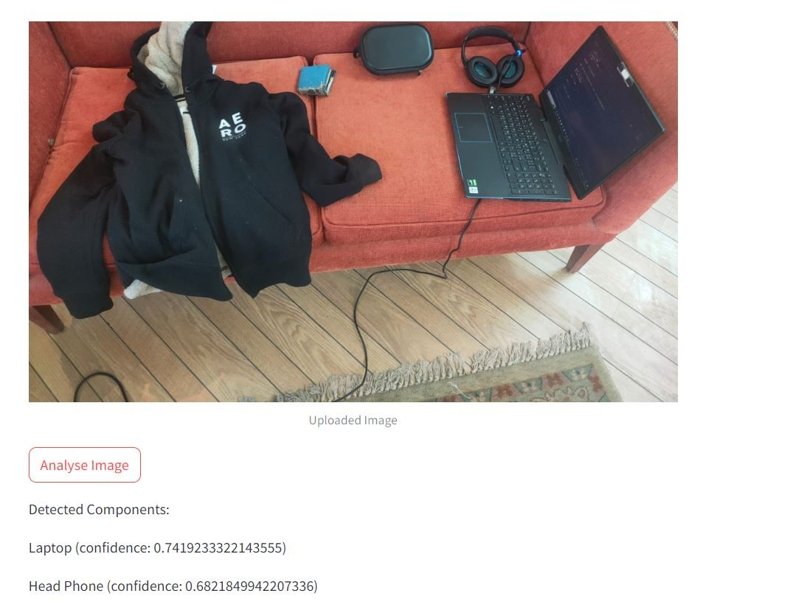

# ImageDetector

This is a simple image detector using YOLOV8 and fine-tuned YOLOV5 on objects365 dataset.

## Results from YOLOV8

_YOLOV8 detected the objects in the faster time than YOLOV5_


## Results from YOLOV5

_Fine-tuned YOLOV5 detected more objects than YOLOV8_


## How to install and run

1. Clone the repository
2. Install the requirements

```bash
pip install -r requirements.txt
```

3. Run the detector

```bash
streamlit run main.py
```

4. Upload an image and see the results

## References

1. [YOLOv5 Releases](https://github.com/ultralytics/yolov5/releases)
2. [Ultralytics YOLO](https://github.com/ultralytics/ultralytics)
3. [Objects365](https://openaccess.thecvf.com/content_ICCV_2019/papers/Shao_Objects365_A_Large-Scale_High-Quality_Dataset_for_Object_Detection_ICCV_2019_paper.pdf)
